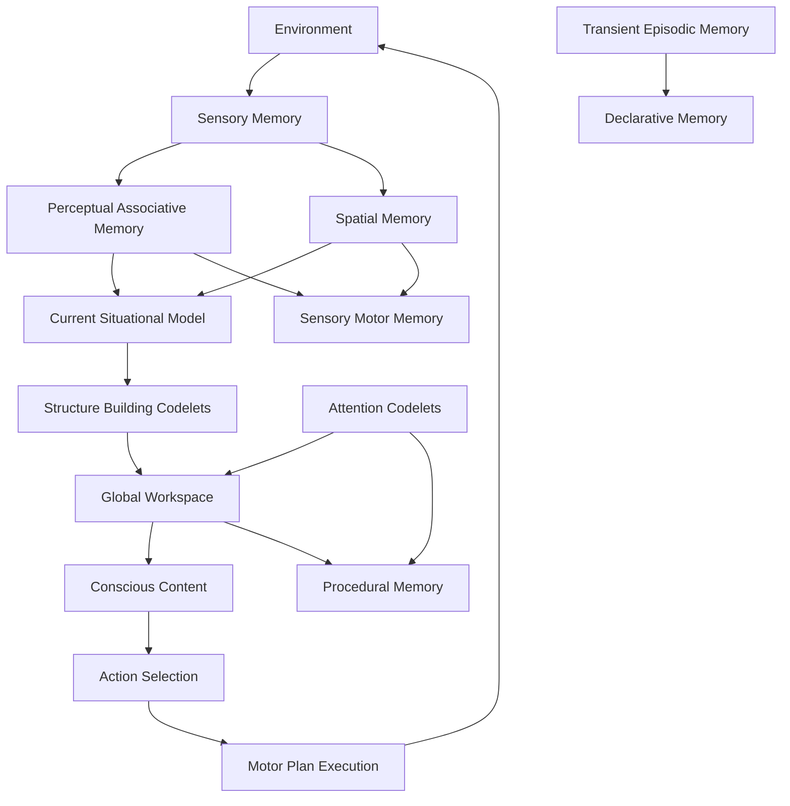

# Cognitive Architecture Prototype

A Python implementation of a cognitive architecture inspired by Global Workspace Theory, featuring modular memory systems, consciousness processing, and learning pathways.

## Architecture Overview

This prototype implements the cognitive architecture described in [AGENT.MD](AGENT.MD), featuring:

- **Memory Systems**: Sensory, Perceptual, Spatial, Episodic, Declarative, Procedural, and Sensory-Motor
- **Consciousness Layer**: Global Workspace, Current Situational Model, and Codelets
- **Motor Systems**: Action Selection and Motor Plan Execution
- **Learning Pathways**: Interconnected learning between all memory systems
- **LangGraph Integration**: Uses LangGraph functional API for orchestration

## Components

### Memory Systems (`memory_systems.py`)
- **SensoryMemory**: Temporary storage of sensory inputs
- **PerceptualAssociativeMemory**: Short-term perceptual processing and associative learning
- **SpatialMemory**: Stores and retrieves spatial relationships
- **TransientEpisodicMemory**: Temporarily holds episodes for integration
- **DeclarativeMemory**: Long-term storage of facts and events
- **ProceduralMemory**: Stores learned behaviors (schemes)
- **SensoryMotorMemory**: Encodes motor patterns and supports motor learning

### Consciousness Layer (`consciousness.py`)
- **GlobalWorkspace**: Central arena for conscious processing
- **CurrentSituationalModel**: Integrates percepts, cues, and associations
- **StructureBuildingCodelet**: Constructs structured coalitions
- **AttentionCodelet**: Directs attention and facilitates attentional learning

### Motor Systems (`motor_systems.py`)
- **ActionSelection**: Chooses behaviors based on situational context
- **MotorPlanExecution**: Executes selected behaviors in the environment

### Learning Pathways (`learning_pathways.py`)
- **PerceptualLearning**: Perceptual Associative Memory → Sensory Motor Memory
- **SpatialLearning**: Spatial Memory → Sensory Motor Memory
- **EpisodicLearning**: Transient Episodic Memory → Declarative Memory
- **ProceduralLearning**: Global Workspace → Procedural Memory
- **AttentionalLearning**: Attention Codelets → Procedural Memory

### Main Agent (`cognitive_agent.py`)
- **CognitiveAgent**: Main orchestrator using LangGraph functional API
- Implements complete cognitive cycle: Sensory → Perceptual → Consciousness → Action → Learning

## Installation

```bash
pip install -r requirements.txt
```

## Usage

### Run Comprehensive Tests
```bash
python test_agent.py
```

### Interactive Demo
```bash
python test_agent.py interactive
```

### Programmatic Usage
```python
import asyncio
from cognitive_agent import CognitiveAgent

async def main():
    agent = CognitiveAgent("my_agent")
    response = await agent.process_input("Hello, how do you work?")
    print(response)
    
    # Get agent status
    status = agent.get_agent_status()
    print(status)

asyncio.run(main())
```

## Architecture Flow



## Key Features

1. **Modular Memory Systems**: Each memory type has distinct characteristics and interactions
2. **Global Workspace Theory**: Consciousness emerges from competition between coalitions
3. **Learning Integration**: Multiple learning pathways connect memory systems
4. **Action-Oriented**: Links perception to action through motor systems
5. **Attention Management**: Codelets direct and sustain attention
6. **Temporal Processing**: Handles episodic memory and temporal sequences
7. **LangGraph Orchestration**: Uses state graphs for cognitive cycle management

## Testing

The prototype includes comprehensive tests:

- **Basic Functionality**: Core cognitive processing
- **Learning Progression**: Memory consolidation and skill acquisition
- **Memory Integration**: Cross-system memory interactions
- **Consciousness Competition**: Multiple stimuli processing
- **Action Selection**: Behavior selection and execution

## Development

To extend the architecture:

1. **Add Memory Systems**: Implement new memory types in `memory_systems.py`
2. **Create Codelets**: Add specialized processing in `consciousness.py`
3. **Define Actions**: Add new behavioral schemes in `motor_systems.py`
4. **Implement Learning**: Add new learning pathways in `learning_pathways.py`
5. **Extend Agent**: Modify the cognitive cycle in `cognitive_agent.py`

## Architecture Benefits

- **Biologically Inspired**: Based on cognitive science and neuroscience
- **Modular Design**: Easy to extend and modify individual components
- **Learning Capable**: Adapts and improves through experience
- **Attention Management**: Handles multiple concurrent processes
- **Action-Oriented**: Links cognition to behavior
- **Explainable**: Clear information flow and decision processes

## Future Enhancements

- Integration with external environments (robotics, simulation)
- Advanced learning algorithms (reinforcement learning, neural networks)
- Emotional and motivational systems
- Social cognition and communication
- Long-term memory consolidation
- Metacognitive monitoring and control
